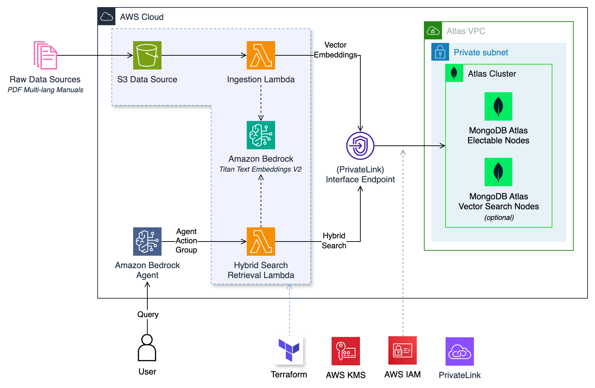

# MongoDB Atlas Hybrid Search Action for Bedrock Agent - Terraform

This project demonstrates how to deploy a set of resources on AWS to implement a **MongoDB Hybrid-Search powered Retrieval-Augmented Generation (RAG) architecture**. The stack (`MdbBedrockActionsStack`) includes:



- An S3 Bucket to ingest PDF documents into a Knowledge Base.
- MongoDB Atlas as the Knowledge Base Vector Store.
- A Lambda function to synchronize (ingest, update, remove) PDFs added to the S3 Bucket.
- A Lambda function to serve as an entry point for performing Hybrid Search (Vector + Full-Text) into MongoDB Atlas.

## Useful commands

- `terraform init` initializes the Terraform project and downloads provider plugins
- `terraform plan` creates an execution plan, showing proposed changes
- `terraform apply` deploys the stack by applying the changes

For more info and examples, check [Terraform MongoDB Atlas Provider](https://github.com/mongodb/terraform-provider-mongodbatlas/tree/master)

## Prerequisites

- AWS CLI configured with appropriate permissions.
- Terraform installed.
- MongoDB Atlas account and API keys.
- Node.js and npm installed.

## Project Structure

```plaintext
.
├── bin
│   └── mdb-bedrock-actions.ts       # CDK App entry point
├── lib
│   └── mdb-bedrock-actions-stack.ts # The CDK stack
├── functions
│   ├── common                       # (shared modules)
│   ├── ingest                       # Sync Lambda function code
│   └── retrieval                    # Hybrid Search retrieval func code
├── cdk.json                         # CDK configuration
├── package.json                     # Node.js dependencies
└── README.md                        # Project documentation
```

## Resources

### S3 Bucket

An S3 Bucket is created to ingest PDF documents. The bucket is configured with event notifications to trigger the synchronization Lambda function whenever a PDF is added, updated, or removed.

### MongoDB Atlas

MongoDB Atlas is used as the Knowledge Base Vector Store. Ensure you have your MongoDB Atlas API keys and connection string ready. The stack will create necessary collections and indexes for vector and full-text search.

### Synchronization Lambda

This Lambda function is triggered by S3 events. It handles the ingestion, update, and removal of PDFs in the MongoDB Atlas Knowledge Base.

### Hybrid Search Lambda

This Lambda function serves as an entry point for performing hybrid searches (Vector + Full-Text) in MongoDB Atlas. It can be invoked via API Gateway or other AWS services.

# Deployment

1. **Clone the repository:**

    ```bash
    git clone https://github.com/your-repo/rag-architecture.git
    cd rag-architecture
    ```

2. **Install dependencies:**

    ```bash
    cd functions/; npm install; cd ..
    ```

3. **Bootstrap the Terraform environment:**

    ```bash
    terraform init
    ```

4. **Configure AWS credentials**

    Ensure your AWS and MongoDB Atlas credentials are set up.**

    This can be done using environment variables:

    ``` bash
    export AWS_SECRET_ACCESS_KEY='<aws secret key>'
    export AWS_ACCESS_KEY_ID='<aws key id>'
    ```

    ... or the `~/.aws/credentials` file.

    ```
    $ cat ~/.aws/credentials
    [default]
    aws_access_key_id = your key id
    aws_secret_access_key = your secret key

    ```
    ... or follow as in the `variables.tf` file and create **terraform.tfvars** file with all the variable values, ex:
    ```
    access_key   = "<AWS_ACCESS_KEY_ID>"
    secret_key   = "<AWS_SECRET_ACCESS_KEY>"
    ```

5. **Deploy the Terraform stack:**

    ```bash
    terraform plan
    terraform apply
    ```

## Integrating with MongoDB Atlas

To integrate the Lambda functions with your existing MongoDB Atlas cluster, follow these steps:

1. **Obtain MongoDB Connection String:**
    - Log in to your MongoDB Atlas account.
    - Navigate to your cluster and click on "Connect".
    - Choose "Connect your application" and copy the connection string.

2. **Configure AWS credentials**

    Ensure your AWS and MongoDB Atlas credentials are set up.**

    This can be done using environment variables:

    ``` bash
    export AWS_SECRET_ACCESS_KEY='<aws secret key>'
    export AWS_ACCESS_KEY_ID='<aws key id>'
    ```

    ```bash
    export TF_VAR_mongodb_conn_string="<atlas connection string>"
    export TF_VAR_mongodb_conn_secret="<atlas secret in AWS Secret manager>"
    ```

    ... or the `~/.aws/credentials` file.

    ```
    $ cat ~/.aws/credentials
    [default]
    aws_access_key_id = your key id
    aws_secret_access_key = your secret key

    ```
    ... or follow as in the `variables.tf` file and create **terraform.tfvars** file with all the variable values, ex:
    ```
    access_key   = "<AWS_ACCESS_KEY_ID>"
    secret_key   = "<AWS_SECRET_ACCESS_KEY>"
    mongodb_conn_string   = "<MONGODB_CONN_STRING>"
    mongodb_conn_secret  = "<MONGODB_CONN_SECRET>"
    ```

2. **Set Environment Variables:**
    - Set the `mongodb_conn_string` or `mongodb_conn_secret` environment variable on `lib/mdb-bedrock-actions-stack.ts`:
       - **Opiton 1**: Update the `mongodb_conn_string` environment variable for the `ingestLambda` and `retrievalLambda` configurations with your MongoDB connection string.
       - **Option 2 (Recommended):** Update `mongodb_conn_secret` environment variable for the `ingestLambda` and `retrievalLambda` configurations with a secret that contains your MongoDB connection string.

3. **Create Indexes:**
    - Ensure that your MongoDB collections have the necessary indexes for vector and full-text search. You can create these indexes using the MongoDB Atlas UI or via the MongoDB shell.
    - Vector Search Index [(learn more)](https://www.mongodb.com/docs/atlas/atlas-vector-search/vector-search-type/):
    ```jsonc
    {
      "fields": [
        {
          "numDimensions": 1024,
          "path": "embedding",
          "similarity": "cosine",
          "type": "vector"
        },
        {
          "path": "metadata",
          "type": "filter"
        },
        {
          "path": "metadata.source",
          "type": "filter"
        }
        // can be extended with additional fields
      ]
    }
    ```
    - Full-Text Search Index [(learn more)](https://www.mongodb.com/docs/atlas/atlas-search/manage-indexes/):
    ```jsonc
    {
      "mappings": {
        "dynamic": false,
        "fields": {
          "text": {
            "type": "string"
          }
        }
      }
    }
    ```

## Integrating with with Bedrock Agent

The Hybrid Search Lambda can be integrated as an Action Group of a Bedrock Agent to enable a full RAG architecture. Bedrock can be used for:

- **Foundation Models:** Leveraging pre-trained models for various NLP tasks.
- **Prompt Building:** Constructing prompts to query the Knowledge Base.
- **Guardrails:** Ensuring safe and reliable responses.

### Steps to Integrate with Bedrock

1. **Create a Bedrock Agent:**
   - Define the agent's purpose and capabilities.
   - Configure the agent to use the Hybrid Search Lambda as an Action Group.

2. **Configure Action Group:**
   - Set up the Action Group to invoke the Hybrid Search Lambda.
   - Define the input and output formats for the Lambda function.

3. **Deploy and Test:**
   - Deploy the Bedrock Agent.
   - Test the integration by querying the agent and verifying the responses.

By following these steps, you can leverage Bedrock for the Foundation Models, Prompt Building, and Guardrails, while using MongoDB Atlas as the Knowledge Base for a complete RAG architecture.

## Conclusion

This project provides an example of how to leverage a RAG architecture using AWS CDK, S3, MongoDB Atlas, and AWS Lambda. By integrating with Bedrock, you can enhance the architecture with advanced NLP capabilities and ensure robust and reliable responses.

For more information, refer to the [AWS CDK documentation](https://docs.aws.amazon.com/cdk/latest/guide/home.html) and [MongoDB Atlas documentation on Hybrid Search](https://www.mongodb.com/docs/atlas/atlas-vector-search/tutorials/reciprocal-rank-fusion/).

<sup>
This software distributed under the License is distributed on an "AS IS" BASIS,
WITHOUT WARRANTIES OR CONDITIONS OF ANY KIND, either express or implied.
See the LICENSE.md for the specific language governing permissions and
limitations under the License.
</sup>
